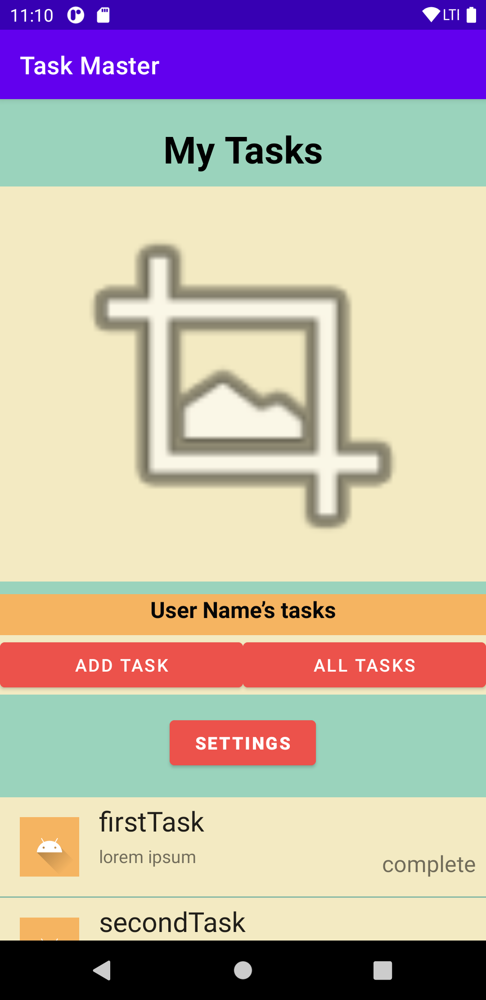
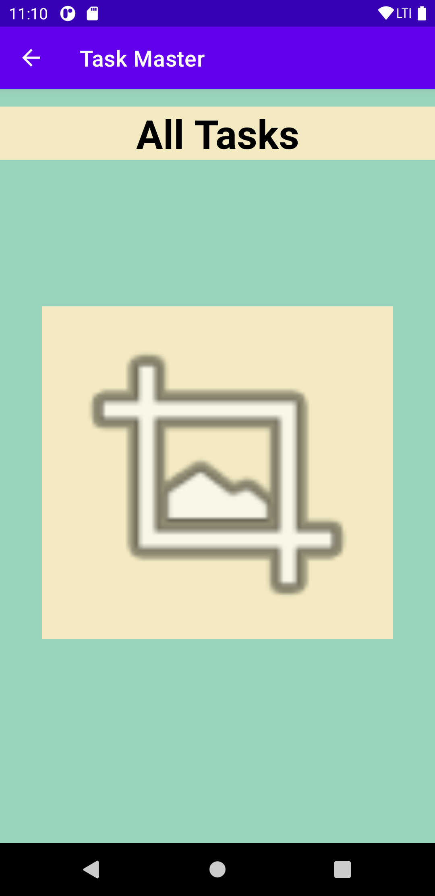
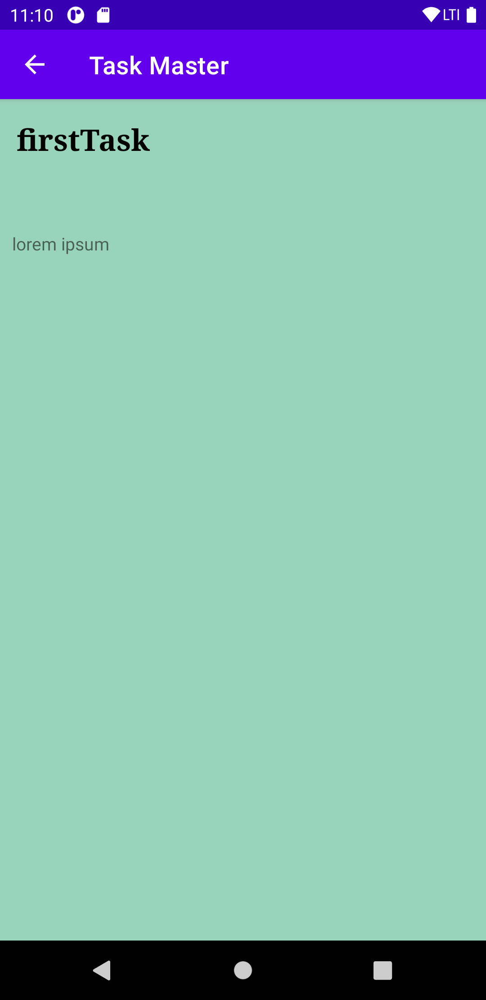
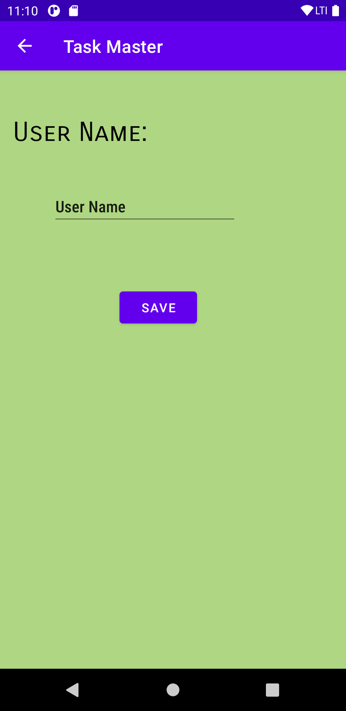
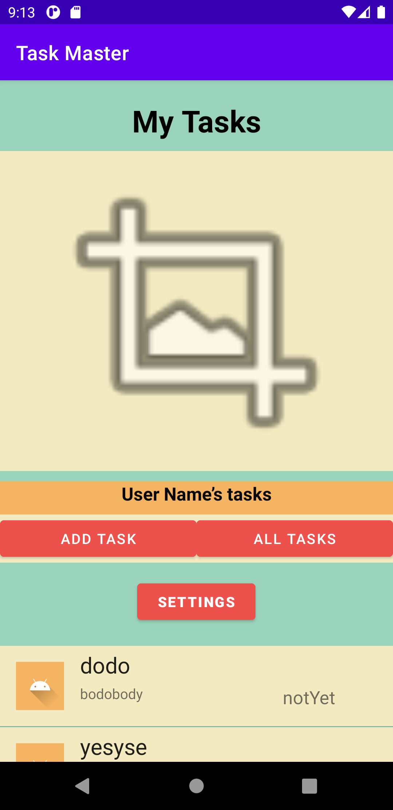
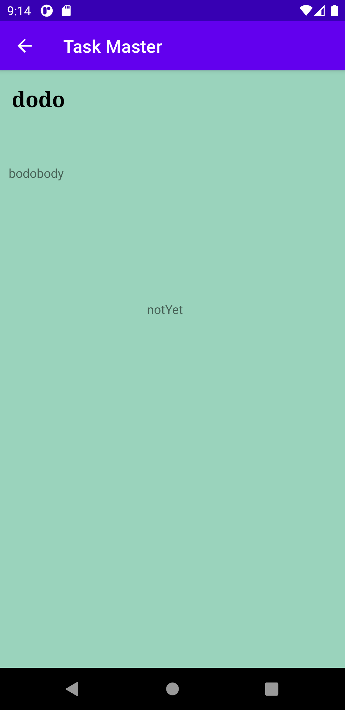

# taskmaster
### Lab: 27 - Data in TaskMaster
` Task Detail Page ` 

Create a Task Detail page. It should have a title at the top of the page, and a Lorem Ipsum description.

` Settings Page `

Create a Settings page. It should allow users to enter their username and hit save.

`Homepage`

The main page should be modified to contain three different buttons with hardcoded task titles. When a user taps one of the titles, it should go to the Task Detail page, and the title at the top of the page should match the task title that was tapped on the previous page.

The homepage should also contain a button to visit the Settings page, and once the user has entered their username, it should display “{username}’s tasks” above the three task buttons.

### Screenshots
##### Homepage

##### Task Detail

----------------------------------------------------------------------------

### Lab: 28 - RecyclerViews for Displaying Lists of Data
`Task Model`
Create a Task class. A Task should have a title, a body, and a state. The state should be one of “new”, “assigned”, “in progress”, or “complete”.

`Homepage`
Refactor your homepage to use a RecyclerView for displaying Task data. This should have hardcoded Task data for now.

Some steps you will likely want to take to accomplish this:

Create a ViewAdapter class that displays data from a list of Tasks.
In your MainActivity, create at least three hardcoded Task instances and use those to populate your RecyclerView/ViewAdapter.
Ensure that you can tap on any one of the Tasks in the RecyclerView, and it will appropriately launch the detail page with the correct Task title displayed.

### Screenshots
#### Homepage

#### All Tasks

#### Add Task

#### Task Detail

#### Setting

----------------------------------------------------------------------------

### Lab: 28 - RecyclerViews for Displaying Lists of Data
`Task Model and Room`
Following the directions provided in the Android documentation, set up Room in your application, and modify your Task class to be an Entity.

`Add Task Form`
Modify your Add Task form to save the data entered in as a Task in your local database.

`Homepage`
Refactor your homepage’s RecyclerView to display all Task entities in your database.

`Detail Page`
Ensure that the description and status of a tapped task are also displayed on the detail page, in addition to the title. (Note that you can accomplish this by passing along the entire Task entity, or by passing along only its ID in the intent.)

### Screenshots
#### Homepage

#### Add Task

#### Task Detail

